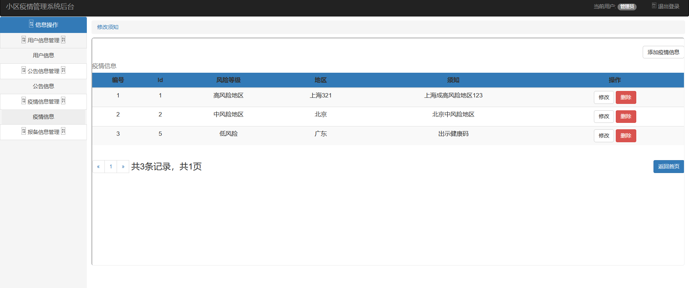

# 图书馆管理系统

### 概述
基于Spring + Spring MVC + MyBatis的小区疫情防控管理系统，使用Maven进行包管理。
主要功能包括：等。

### 环境配置
##联系方式：Drake816@qq.com
#### 开发环境：Windows 10，IntelliJ IDEA 2021.3
#### 运行配置
1. 首先安装Mysql8.0，设置用户名为root，密码为123456，并保证其在运行状态，并执行library.sql文件导入数据。
2. 然后再配置Maven到环境变量中，在源代码目录下运行
```sh
# mvn jetty:run
```
3. 使用浏览器访问http://localhost:8080即可进入系统。

### 概念设计

### 功能展示
#### 1.	首页登陆





#### 2.	管理员系统
用登陆进入